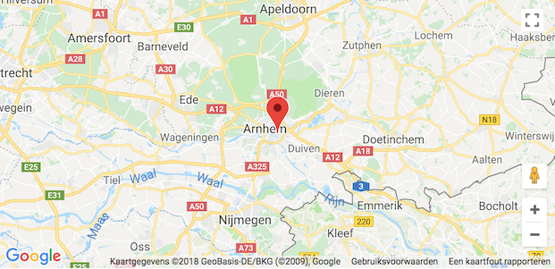
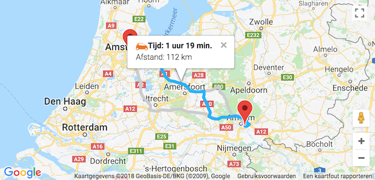

# Google Maps Base module

## Introduction
This package comes with a number of classes:
* `Gmap` - base class that can be used to render a map and place markers on it
* `Service` - Abstract class used to extend service classes from
* `Observable` - Event registration and dispatching class
* `Directions` - Service instance with which routes can be calculated and plotted on the map

The Gmap class can tap into all Google Maps APIs. The available APIs are listed here: https://developers.google.com/maps/documentation/javascript/reference/3.exp/.

## Basic use
### Rendering a map
```javascript
import { Gmap } from 'gmap-base';

// reference the element in which the map should be rendered
const rootElement = document.getElementById('map-container)';

// set the center; a regular address is expected and will be geocoded by the class
const center = 'Dam Square, Amsterdam';

// set the value for the API key. Note that the key should be set to have access to, at least, the Maps Javascript API as well as the Directions API (or Maps and Routes in the Google Maps Platform settings)
const apiKey = 'here-be-a-google-api-key';

// instantiate the map class. By default, the map is rendered in the root element, unless 'renderMapOnApiReady' is passed to the constructor with value 'false'.
const map = new Gmap({
    rootElement,
    center,
    apiKey,
    // any valid MapOptions interface option can be passed in here
    // see https://developers.google.com/maps/documentation/javascript/reference/3.exp/map#MapOptions for reference
    options = { ... },
});
```



### Interacting with a rendered map (assuming class context)
```javascript
// define callbacks. Not required if no interacting is needed
onMapReady = () => {
    // the map is instantiated and has been rendered in the root element; markers can be placed or other interactions can take place
    this.map.addMarker('Baarn, Paleis Soestdijk, Baarn', (marker) => {
        // adding markers is asynchronous, use a callback function to ensure that the marker has been added to the map before interacting with it
    });

    this.map.addMarker('Keukenhof, Stationsweg, Lisse');
    // etc. etc.

    // after setting markers, the bounds are not automatically updated. Calling 'fitBoundsToVisibleMarkers' will take core of that
    this.map.fitBoundsToVisibleMarkers();

    // removing a marker
    this.map.removeMarker('Baarn, Paleis Soestdijk, Baarn');
};

// instantiate the map class
this.map = new Gmap({
    rootElement,
    center,
    apiKey,
    callbacks: {
        MAP_READY: this.onMapReady,
    },
});
```

### Callbacks

A callback function can be assigned to the following events:
* `API_READY` - inidicates that Google Maps APIs can be instantiated.
* `MAP_READY` - the Gmap class instantiated successfully and the map is rendered, centered on the location of the  address.
* `UNKNOWN_ERROR` - indicates that the request could not be processed due to a server error. The request may succeed if you try again.
* `OVER_QUERY_LIMIT` - indicates that you are over your quota.
* `REQUEST_DENIED` - indicates that your request was denied.
* `INVALID_REQUEST` - generally indicates that the query (address, components or latlng) is missing.
* `ZERO_RESULTS` - indicates that the geocode was successful but returned no results. This may occur if the geocoder was passed a non-existent address.
* `ERROR` - indicates that the request timed out or there was a problem contacting the Google servers. The request may succeed if you try again.

### Methods

The Gmap class offers the following methods to interact with the map:
* `activateInfoWindow(infoWindow, InfoWindowOptions)` - Show an infoWindow at the given position
* `addInfoWindow(google.maps.InfoWindow)` - Push an InfoWindow object onto the stack
* `addMarker(address)` - Add a marker for a specific address to the map
* `closeInfoWindows` - Close all InfoWindow instances that have be registered
* `fitBoundsToVisibleMarkers` - Resize and recenter the core map instance taken the bounds of all visible markers
* `renderMap` - Render an instance of the map in the given rootElement
* `removeMarker(marker)` - Remove a marker from the map by unsetting its reference to the Core map instance
* `setCenter(address)` - Center the map on a given address
* `unsetMarkers` - Remove all markers from the map

## Using services
The Google Maps API comes with a number of services that can be used in conjunction with a rendered map. This `gmap-base` package offer one service: `Directions`.

### `Directions` service
This service can render routes and provide alternatives for those routes and plot them on the map. The service can receive a location (in the form of an address) as well as a travel mode. Valid travel modes:
* `TRANSIT`
* `WALKING`
* `BICYCLING`
* `DRIVING`

#### Instantiation
```javascript
import { Gmap, DirectionsService } from 'gmap-base';

// define callback functions
onApiReady = () => {
    // the Google Maps Directions API is not ready before this callback function is called

    // create a new class instance
    const directionsService = new DirectionsService({
        callbacks: {
            NOT_FOUND: onOriginNotFound,
            OK: onOriginFound,
        },
    });

    // and add it to the Core instance
    this.map.addService(directionsService);
};

onOriginNotFound = (response) => {
    // handle an unfound location
};

onOriginFound = (response) => {
    // origin address has been found
};

// instantiate the map class
this.map = new Gmap({
    rootElement,
    center,
    apiKey,
    callbacks: {
        API_READY: this.onApiReady,
        MAP_READY: this.onMapReady,
    },
});
```

#### Getting directions
Assuming that the page in which the map is rendered, has a form with fields that allow for entering an address as well as selecting a travel mode, your implementation should have a function that handles that type of input:

```javascript
onChangeDirections(destination, origin, travelMode) {
    const directionsService = this.map.getService('Directions');

    directionsService
        .setInfoWindowContentFunc(this.infoWindowContent)
        .showRoutes({
            destination,
            origin,
            travelMode,
            provideRouteAlternatives: true,
        });
}
```

Calling `showRoutes` will render the results of the directions request on the map. If `provideRouteAlternatives` was passed in, the result will render all suggestions on the map. Each route is clickable and will show a infoWindow when clicked. In order to customise the infowindow contents, a function can be assigned through `setInfoWindowContentFunc`:

```javascript
infoWindowContent({ travelMode, distance, duration }) {
    return `
        ${travelMode}<br />
        Distance: ${distance}<br />
        Duration: ${duration}
    `;
}
```

The function takes an options object as its parameter with the keys `travelMode`, `distance` and `duration`.



#### Methods

The Directions class offers the following methods to interact with the map:

* `activateRoute(route)` - Display a route with the active stroke color
* `addRoute(route)` - Push a Route object onto the stack
* `deactivateRoutes` - Display routes with the idle stroke color
* `fitBoundsToRoutes` - Calling this will re-center the map with all routes in the viewport
* `getRoutes(options, callback)` - Get all route and possible suggestions from the DirectionsService
* `setInfoWindowContentFunc(infoWindowContentFunc)` - Set the InfoWindow content generation function
* `removeOriginMarker` - Remove the origin marker from the core map instance
* `resetDirections` - Clear the core map instance, removing all routes and, when the origin has changed, removing the origin marker
* `setDefaults(options)` - Set route properties
* `setOrigin(address)` - Set the origin for the routes
* `showOriginMarker` - Place a marker on the map to indicate the origin for the routes
* `showRoutes` - Render routes directly on the core map instance
